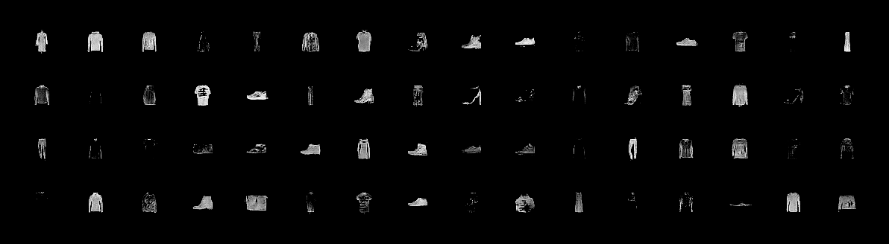
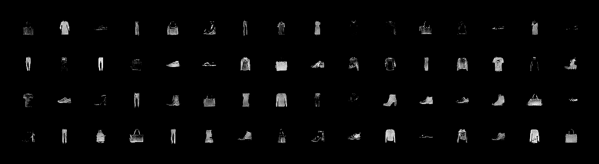

# WGAN-GP
An pytorch implementation of Paper "Improved Training of Wasserstein GANs" on fashion MNSIST dataset.

# GPU used Tesla V100-SXM2-32GB

**Pytorch version 1.3.1**

# Results

  Some Sample Result, you can refer to the [results/](results/) folder for **details**.

  

  

  Sample Result after around 190000 iterarions 

# Acknowledge

Based on the implementation [igul222/improved_wgan_training](https://github.com/igul222/improved_wgan_training) and [martinarjovsky/WassersteinGAN](https://github.com/martinarjovsky/WassersteinGAN)